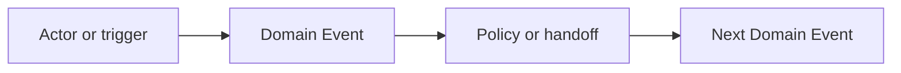
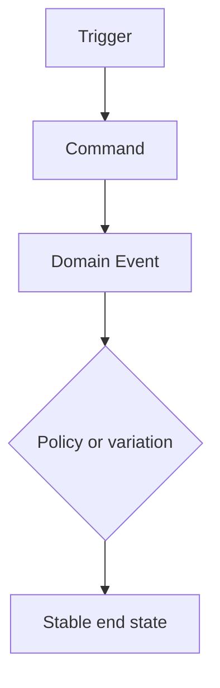
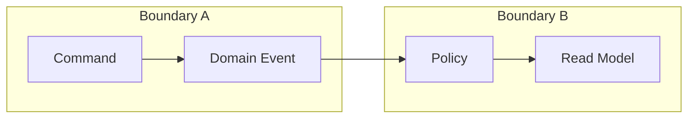
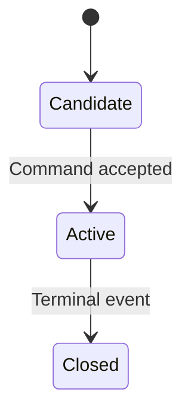
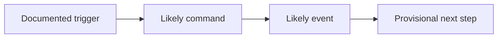

# Deliverables

Use this file when you need a canonical markdown handoff instead of loose notes.

Every template below is format-specific, but all of them must start with the shared top block defined in `output-patterns.md`.
Explanatory lines outside the fenced markdown examples are guidance only and must not appear in final generated documents.

## Shared discovery appendix

Use this appendix only when it materially adds clarity to the chosen format.

```md
## Discovery Synthesis

### Facts
- Fact:

### Assumptions
- Assumption:

### Open Questions
- Open question:

### Risks
- Risk:

### Decisions
- Decision:
```

## Big Picture EventStorming handoff

```md
# Big Picture EventStorming Handoff

## Format
- Big Picture EventStorming

## Objective
- ...

## Scope
- In scope:
- Out of scope:

## Source Basis
- Stakeholders:
- Documents:
- Workshop or pre-work:

## Confidence
- Overall confidence:
- Main confidence limit:

## Validated Narrative
- Main storyline:
- Key pivot or milestone:

## Narrative Diagram


## Main Actors And Systems
- Actor:
- System:

## Hot Spots And Opportunities
- Hot Spot:
- Opportunity:

## Optional Custom Steps Used
- Playing with value:
- Problems and Opportunities:
- Arrow Voting:
- Extracted User Stories:
- Visualised ownership:

## DDD Signals
- Candidate subdomains:
- Language shifts:
- Ownership tensions:
- Candidate bounded-context seams:

## Decisions
- Decision:

## Recommended Next Step
- Process Modelling EventStorming:
- Software Design EventStorming:
- Context-map homework:
```

## Process Modelling EventStorming handoff

```md
# Process Modelling EventStorming Handoff

## Format
- Process Modelling EventStorming

## Objective
- ...

## Scope
- In scope:
- Out of scope:

## Source Basis
- Stakeholders:
- Documents:
- Workshop or pre-work:

## Confidence
- Overall confidence:
- Main confidence limit:

## Stable End State
- ...

## Completed Paths
- Path:
- Stable result:

## Process Diagram


## Commands, Events, And Policies
- Command:
- Event:
- Policy:

## Timers, SLAs, And Variations
- Timer or SLA:
- Variation:

## Stakeholder And UX Concerns
- Concern:
- Reasonably happy because:

## Addressed Hot Spots
- Hot Spot:
- Resolution or remaining concern:

## DDD Signals
- Candidate boundaries:
- Policy-heavy zones:
- Commands or events worth carrying into software design:

## Decisions
- Decision:

## Recommended Next Step
- Another process iteration:
- Software Design EventStorming:
- Implementation planning:
```

## Software Design EventStorming handoff

```md
# Software Design EventStorming Handoff

## Format
- Software Design EventStorming

## Objective
- ...

## Scope
- In scope:
- Out of scope:

## Source Basis
- Stakeholders:
- Documents:
- Workshop or pre-work:

## Confidence
- Overall confidence:
- Main confidence limit:

## Boundaries
- Boundary:
- Why it exists:

## Boundary Diagram


## Commands, Events, And Policies
- Command:
- Event:
- Policy:

## Consistency Rules
- Component or boundary:
- Behaviour that must stay consistent:

## Aggregate Candidates
- Aggregate:
- Responsibility:
- Invariants:
- Events emitted:

## Aggregate Lifecycle


## Read Models
- Read model:
- Decision supported:

## Acceptance-Test Scenarios
- Initial state:
- Trigger:
- Expected events:
- Expected outcome:

## Context-Map Implications
- Upstream/downstream relation:
- Pattern:

## Remaining Hot Spots
- Hot Spot:

## Decisions
- Decision:
```

If no credible aggregate candidate or lifecycle exists yet, replace the bodies of both `## Aggregate Candidates` and `## Aggregate Lifecycle` with the exact placeholder `None identified yet.` and omit the lifecycle diagram.

## Document-First EventStorming handoff

```md
# Document-First EventStorming

## Format
- Document-First EventStorming

## Objective
- ...

## Scope
- In scope:
- Out of scope:

## Source Basis
- Stakeholders:
- Documents:
- Workshop or pre-work:

## Confidence
- Overall confidence:
- Main confidence limit:

## Source Inventory
- Source:
- Freshness:
- Trust level:

## Provisional Narrative
- Stream:
- Confidence:

## Provisional Narrative Diagram


## Candidate Commands, Events, And Policies
- Command:
- Event:
- Policy:

## DDD Signals
- Candidate bounded-context seam:
- Ownership ambiguity:
- Aggregate pressure:

## High-Risk Unknowns
- Risk:

## Questions To Validate
- Open question:

## Recommended Next Official Format
- Big Picture EventStorming:
- Process Modelling EventStorming:
- Software Design EventStorming:
```

## Context card template

```md
## Bounded Context: <name>

### Purpose
- ...

### Ubiquitous Language
- Term:

### Decisions Owned
- ...

### Dependencies
- Upstream:
- Downstream:

### Policies And Invariants
- ...

### Candidate Aggregates
- ...
```

## Aggregate card template

```md
## Aggregate Candidate: <name>

### Responsibility
- ...

### Commands Handled
- ...

### Invariants
- ...

### Events Emitted
- ...

### What Stays Outside
- ...
```

## Acceptance-test template

```md
## Acceptance Test Scenario: <name>

### Given
- ...

### When
- ...

### Then
- Event:
- State:
- Read-model outcome:
```
