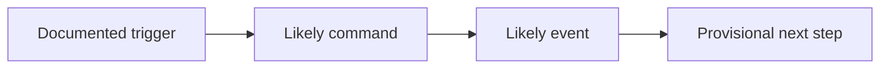

# Document-First Mode

Use this file when the main inputs are documents rather than a live room of stakeholders.

## When to use it

Use document-first mode when:

- stakeholder access is limited or delayed
- the business already has written material worth mining
- you need a provisional model before a workshop
- you are validating whether a workshop is even worth scheduling

Good inputs:

- product briefs
- SOPs
- support macros and escalation guides
- terms and policies
- onboarding docs
- workflow screenshots
- exported tickets
- backlog items
- vendor docs
- org charts

## Core rule

Do not mistake documented intent for observed reality.

Every extracted item must carry an evidence level:

- `Confirmed by source`
- `Likely inference`
- `Assumption to validate`

## Extraction sequence

### 1. Inventory the sources

Capture:

- source name
- source type
- apparent date or freshness
- likely owner
- trust level

### 2. Extract candidate building blocks

From the documents, pull out:

- actors and roles
- external systems
- candidate domain terms
- candidate events
- candidate commands or decisions
- policies, rules, thresholds, or approvals
- timers, renewal cycles, expiry windows, and SLAs
- failure modes and exceptions

Prefer business phrases from the source material, but normalize obvious duplicates.

### 3. Build a provisional narrative

Arrange the strongest candidate events into one or more streams.

Mark each step with confidence:

- `High confidence`
- `Medium confidence`
- `Low confidence`

If the order is unclear, say so rather than inventing certainty.

### 4. Extract DDD signals carefully

Capture only what the evidence supports:

- candidate ubiquitous language
- likely bounded-context seams
- policy-heavy zones
- ownership ambiguity
- aggregate pressure

Mark these as provisional if stakeholder validation is still missing.

### 5. Choose the next official format

Default rule:

- choose Big Picture if the business narrative or scope is still wide or disputed
- choose Process Modelling if one end-to-end process is already the clear focus
- choose Software Design only if the focused process and major boundaries are already credible

Do not stop at document synthesis unless the user explicitly asks for analysis only.

## Output structure

Use the canonical `Document-First EventStorming` template from `deliverables.md`.

Required sections for every final document-first output:

- shared top block from `output-patterns.md`
- `Source Inventory`
- `Provisional Narrative`
- `Provisional Narrative Diagram`
- `Candidate Commands, Events, And Policies`
- `DDD Signals`
- `High-Risk Unknowns`
- `Questions To Validate`
- `Recommended Next Official Format`

The `Provisional Narrative Diagram` must be Mermaid and must use `flowchart LR`.

Reference shape:

```md
# Document-First EventStorming

## Format
- Document-First EventStorming

## Objective
- ...

## Scope
- In scope:
- Out of scope:

## Source Basis
- Stakeholders:
- Documents:
- Workshop or pre-work:

## Confidence
- Overall confidence:
- Main confidence limit:

## Source Inventory
- Source:
- Freshness:
- Trust level:

## Provisional Narrative
- Stream:
- Confidence:

## Provisional Narrative Diagram


## Candidate Commands, Events, And Policies
- Command:
- Event:
- Policy:

## DDD Signals
- Candidate bounded-context seam:
- Ownership ambiguity:
- Aggregate pressure:

## High-Risk Unknowns
- ...

## Questions To Validate
- ...

## Recommended Next Official Format
- Big Picture EventStorming:
- Process Modelling EventStorming:
- Software Design EventStorming:
```

## Quality rules

- Distinguish current-state behaviour from desired-state plans.
- Prefer explicit rules over marketing copy.
- Treat screenshots and UI text as hints, not proof of ownership or invariants.
- Treat unresolved contradictions as useful findings.
- Convert the document set into a better conversation, not a false sense of completeness.
